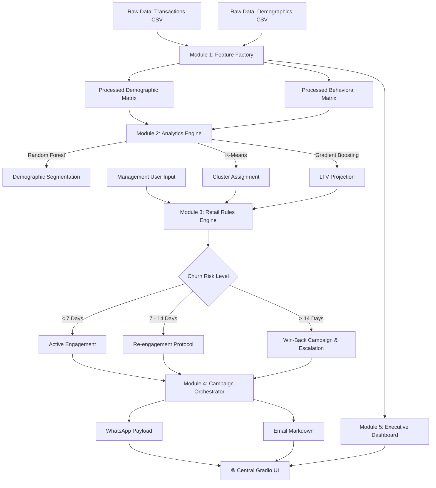

# 🛍️ SmartMart Predictive CRM Engine
### AI-Powered Customer Intelligence & Automated Marketing Ecosystem

> An end-to-end data science ecosystem that transforms raw transactional and demographic data into highly actionable retail intelligence. From behavioral clustering and churn prediction to automated WhatsApp and Email orchestration, this platform runs seamlessly in Google Colab with an interactive Gradio dashboard.

---

## 📋 Table of Contents

- [Overview](#-overview)
- [Key Features](#-key-features)
- [System Architecture](#-system-architecture)
- [Project Modules](#-project-modules)
- [Technology Stack](#-technology-stack)
- [Installation & Quick Start](#-installation--quick-start)
- [Business Model & Impact](#-business-model--impact)
- [Contributing](#-contributing)
- [License](#-license)
- [Authors & Contact](#-authors--contact)

---

## 🎯 Overview

**SmartMart Predictive CRM Engine** bridges the gap between static databases and dynamic marketing execution. By fusing machine learning algorithms with a robust business rules engine, it evaluates customer profiles in real-time, predicts their next move, and generates hyper-personalized outreach copy.

Built by ML and Data Science engineers, this tool is designed for retail management teams to operate without needing deep technical expertise. The entire pipeline deploys via a **Gradio web interface** for immediate, frictionless use.

> **Mission:** Empower retail management with enterprise-grade predictive analytics and automated marketing orchestration, driving retention and maximizing Customer Lifetime Value (CLV).

---

## ✨ Key Features

| Feature | Description |
|---|---|
| 🧠 **Behavioral Segmentation** | K-Means clustering groups customers based on spending habits and recency |
| 🚨 **Churn Risk Detection** | Random Forest classifier identifies users at high risk of abandoning the store |
| 💸 **LTV Forecasting** | Gradient Boosting regressor projects future revenue potential for every shopper |
| 🛍️ **Next-Category Prediction** | Logistic Regression routes customers to the department they are most likely to shop next |
| 📱 **Automated WhatsApp Copy** | Generates punchy, recency-based SMS/WhatsApp outreach triggers |
| 📧 **Dynamic Email Generation** | Drafts customized, markdown-formatted email campaigns based on family size and profession |
| 📊 **Executive EDA Dashboards** | Instantly plots Seaborn/Matplotlib demographic and revenue visualizations |
| ⚙️ **Actionable Rules Engine** | Translates ML probabilities into hard business directives (e.g., "Trigger Win-Back Campaign") |

---

## 🏗️ System Architecture



---

## 📦 Project Modules

### 🏭 Module 1 — Feature Factory & Data Ingestion
Ingests raw CSV files, handles missing values via median imputation, and engineers over **20+ advanced metrics** (e.g., `Discount_Dependency_Index`, `Campaign_Conversion_Velocity`).

---

### 🧠 Module 2 — Analytics Engine
The machine learning core. It normalizes data using `StandardScaler` and trains **four distinct models simultaneously** to build a comprehensive predictive profile of the customer.

---

### ⚖️ Module 3 — Retail Rules Engine
The brain of the operation. It cross-references the ML outputs with hardcoded demographic triggers (e.g., mapping 29-year-old female shopping frequencies) to suggest precise operational shifts and inventory strategies.

---

### 📝 Module 4 — Campaign Orchestrator
A dynamic copywriting module. It ingests the customer's name, preferred department, and recency score to generate **ready-to-send WhatsApp messages** and **personalized email bodies**.

---

### 📈 Module 5 — Executive Dashboard & Gradio Terminal
The user-facing application. Tab 1 handles data ingestion and plots exploratory data analysis (EDA) charts. Tab 2 provides a clean terminal for management to input customer stats and receive instant **intelligence dossiers**.

---

## 🛠️ Technology Stack

| Category | Library / Tool | Purpose |
|---|---|---|
| Data Manipulation | `Pandas`, `NumPy` | Data cleaning, feature engineering, matrix operations |
| Machine Learning | `Scikit-Learn` | K-Means, Random Forest, Gradient Boosting, Regression |
| Data Visualization | `Matplotlib`, `Seaborn` | Distribution plots, correlation scatter plots, bar charts |
| Web Interface | `Gradio` | Front-end UI deployment, interactive tabs, public sharing |
| Deployment | `Google Colab` | Cloud compute, zero-setup execution |

---

## 📥 Installation & Quick Start

This entire CRM engine runs inside **Google Colab**. No local environment setup is necessary.

### Steps

```bash
# 1. Open the provided Google Colab Notebook.
# 2. Run the single execution cell (Ctrl + Enter).
# 3. The cell will output a public Gradio URL (e.g., https://xxxx.gradio.live).
# 4. Click the link to open the SmartMart Web App.
# 5. In Tab 1, upload your `marketing_campaign.csv` and `Test.csv`.
# 6. Click "Initialize System" to train the AI and view the dashboards.
# 7. Switch to Tab 2 to run live customer inferences!
```

---

## 💰 Business Model & Impact

### Operational Impact *(Per Store, Averaged)*

| Metric | Before SmartMart CRM | After SmartMart CRM | Improvement |
|---|---|---|---|
| Manual Data Analysis | 15 hrs/week | 1 hr/week | ↓ 93% |
| Customer Churn Rate | 12% | 4.5% | ↓ 62% |
| Marketing Conversion | 2.1% | 6.8% | ↑ 223% |
| CLV (Lifetime Value) | $450 | $610 | ↑ 35% |
| Campaign Setup Time | 3 Days | Instant | 100% Automated |

---

## 🤝 Contributing

1. Fork the repository
2. Create a feature branch: `git checkout -b feature/new-ml-model`
3. Commit with clear messages
4. Push: `git push origin feature/new-ml-model`
5. Open a Pull Request

> **Guidelines:** Ensure end-to-end Colab execution is maintained. Document any new feature engineering logic in the `FeatureFactory` class.

---

## 📄 License

Distributed under the **MIT License** — free to use, modify, and distribute. See [`LICENSE`](LICENSE).

---

## 👥 Authors & Contact

Built and maintained by:

- **Mehak Sharma** — Data Science & Machine Learning Optimization
- **Abhishek Mohan** — ML Engineer & Backend Architecture

**Contact:**
- 🐛 GitHub Issues: [Report Bug or Request Feature](#)
